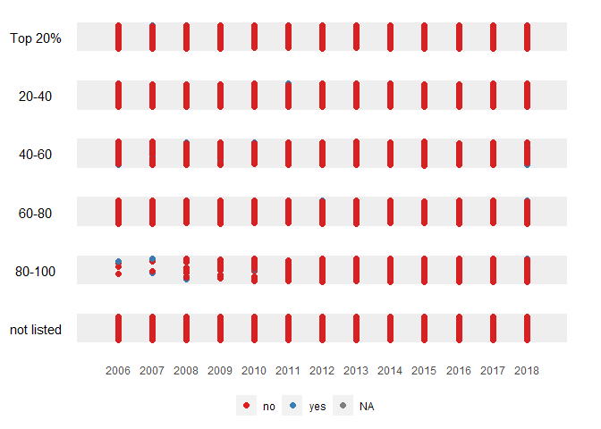
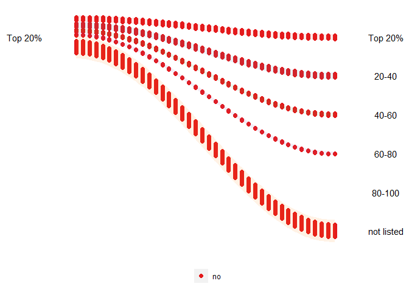
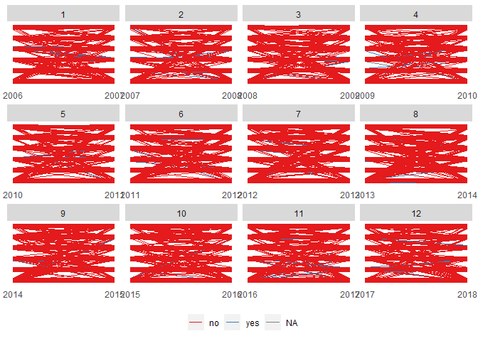
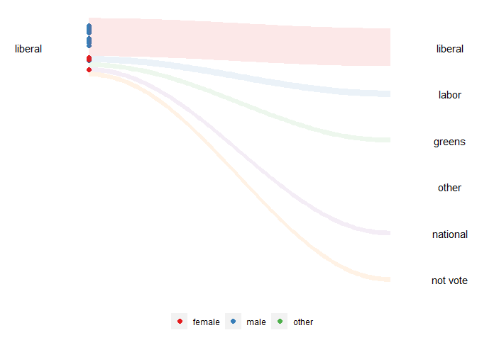

<!-- README.md is generated from README.Rmd. Please edit that file -->

# animbook

<!-- badges: start -->
<!-- badges: end -->

“animbook” is a package to help the user visualize the movement of the
observations over time. It is a package to help prep the data, plot, and
animate.

## Installation

You can install the development version of animbook from
[GitHub](https://github.com/KrisanatA/animbook) with:

``` r
# install.packages("devtools")
devtools::install_github("KrisanatA/animbook")
```

## Usage

``` r
library(animbook)
```

We will be using the dataset provided by the package `osiris`. There are
three stages in this package that the users need to follow.

### First stage: Prepare the data

In this stage, we first need to prepare the data structure to a specific
format. This function will assign a frame, calculate the scaling, and
create the necessary data and settings for the next stage.

The data needs to contain the following variable for the function to
work:

- id: `firmID`, it needs to be a factor variable.
- values: `sales`, it need to be a numeric variable.
- time: `year`, it needs to be an integer variable.

``` r
animbook <- anim_prep(osiris, firmID, sales, year)
```

There are also additional options that allow the user to customize.

- label: group labeling.
- ngroup: number of groups we want to split the values into.
- breaks: the group bins size (prototype)
- group_scaling: the grouping variable for the bins calculations.
- color: the variable used to color the observations.
- time_dependent: logical. Whether we want the observations to start at
  the same time or not.
- scaling: the scaling method, either `rank` or `absolute`.
- runif_min: minimum value for random addition to frame numbers
- runif_max: maximum value for random addition to frame numbers

The function can calculate four different scales using these options.

``` r
# rank scaling
rank_scaling <- anim_prep(data = osiris, id = firmID, values = sales, time = year)

# absolute scaling
absolute_scaling <- anim_prep(data = osiris, id = firmID, values = sales, time = year,
                              scaling = "absolute")

# rank scaling by group
rank_group_scaling <- anim_prep(data = osiris, id = firmID, values = sales, time = year, 
                                group = country)

# absolute scaling by group
absolute_group_scaling <- anim_prep(data = osiris, id = firmID, values = sales, time = year,
                                    group = country, scaling = "absolute")

rank_scaling
#> $data
#> # A tibble: 10,270 × 4
#>    id                              time qtile frame
#>    <fct>                          <int> <dbl> <int>
#>  1 1&1 VERSATEL GMBH DE2011730431  2006     2     1
#>  2 1&1 VERSATEL GMBH DE2011730431  2007     2     2
#>  3 1&1 VERSATEL GMBH DE2011730431  2008     2     3
#>  4 1&1 VERSATEL GMBH DE2011730431  2009     2     4
#>  5 1&1 VERSATEL GMBH DE2011730431  2010     2     5
#>  6 1&1 VERSATEL GMBH DE2011730431  2011     2     6
#>  7 1&1 VERSATEL GMBH DE2011730431  2012     0     7
#>  8 1&1 VERSATEL GMBH DE2011730431  2013     0     8
#>  9 1&1 VERSATEL GMBH DE2011730431  2014     0     9
#> 10 1&1 VERSATEL GMBH DE2011730431  2015     0    10
#> # ℹ 10,260 more rows
#> 
#> $settings
#> $settings$gap
#> [1] 1.2
#> 
#> $settings$xbreaks
#>  [1] 2006 2007 2008 2009 2010 2011 2012 2013 2014 2015 2016 2017 2018
#> 
#> $settings$label
#> [1] "5" "4" "3" "2" "1" "0"
#> 
#> $settings$scaling
#>   0%  20%  40%  60%  80% 100% 
#>    1   93  185  277  369  567 
#> 
#> 
#> attr(,"class")
#> [1] "animbook"
```

This function will return `animbook` object containing a list of the
formatted data and settings.

### Second stage: Plotting the data

After preparing the data, we can not plot it. There are three plots
available in this package:

- `kangaroo`, which plots the observation’s movement over time.
- `wallaby`, which subset the plot to either `top` or `bottom` and see
  which group they are in after the observational period.
- `funnel_web_spider`, which is a faceted plot by time variable.

``` r
animbook <- anim_prep(data = osiris, id = firmID, values = sales, time = year, color = japan)

# kangaroo plot
anim_plot(animbook, plot = "kangaroo")
```



``` r

# wallaby plot
anim_plot(animbook, plot = "wallaby")
```



``` r

# funnel web spider plot
anim_plot(animbook, plot = "funnel_web_spider")
```



The `kangaroo` and `wallaby` plots can be animated using the function of
the next stage. `funnel_web_spider` only supported static plot. We can
also choose whether we want to animate the plot using gganimate or
plotly.

### Third stage: Animating the plot

To animate the plot, we need to save the plot into an object, which then
can be passed on to the function.

``` r
animbook <- anim_prep(data = osiris, id = firmID, values = sales, time = year, color = japan)

p <- anim_plot(animbook, plot = "wallaby", width = 0.01)

p2 <- anim_animate(p)
#> You can now pass it to gganimate::animate()

gganimate::animate(p2)
```


