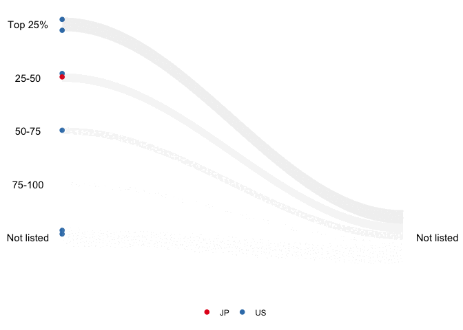
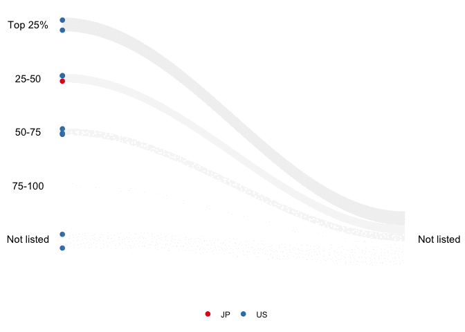

<!-- README.md is generated from README.Rmd. Please edit that file -->

# animbook

<!-- badges: start -->
<!-- badges: end -->

“animbook” is a package to help the user visualize the changes in
performance measures and demographic affiliations using animation. It is
a package to help prepare, plot, and animate the data.

## Installation

You can install the development version of animbook from
[GitHub](https://github.com/KrisanatA/animbook) with:

``` r
install.packages("animbook")
```

## Examples

### Accounting database: osiris

``` r
library(animbook)
library(dplyr)
#> 
#> Attaching package: 'dplyr'
#> The following objects are masked from 'package:stats':
#> 
#>     filter, lag
#> The following objects are masked from 'package:base':
#> 
#>     intersect, setdiff, setequal, union

data <- osiris |> 
  filter(country %in% c("US", "JP"))

label <- c("Top 25%", "25-50", "50-75", "75-100", "Not listed")

accounting <- anim_prep(data, 
                      id = ID, 
                      values = sales, 
                      time = year, 
                      label = label, 
                      ncat = 4, 
                      group = country)

p <- wallaby_plot(accounting,
                  group_palette = RColorBrewer::brewer.pal(9, "Set1"),
                  shade_palette = c("#737373", "#969696", "#BDBDBD",
                                    "#D9D9D9","#D9D9D9","#D9D9D9"),
                  subset = "bottom",
                  relation = "many_one",
                  height = 1,
                  size = 2,
                  width = 100,
                  total_point = 1000)
#> You can now use the animbook::anim_animate() function to
#>           transform it into an animated object

p2 <- anim_animate(p)
#> You can now pass it to gganimate::animate().
#>                    The recommended setting is nframes = 139

gganimate::animate(p2, nframes = 139)
#> 
#> Rendering [>-------------------------------------------] at 8.3 fps ~ eta:
#> 17sRendering [>-------------------------------------------] at 8.6 fps ~ eta:
#> 16sRendering [>-------------------------------------------] at 8.3 fps ~ eta:
#> 16sRendering [=>------------------------------------------] at 8.5 fps ~ eta:
#> 16sRendering [=>------------------------------------------] at 8.7 fps ~ eta:
#> 15sRendering [==>-----------------------------------------] at 8.7 fps ~ eta:
#> 15sRendering [==>-----------------------------------------] at 8.8 fps ~ eta:
#> 15sRendering [===>----------------------------------------] at 8.7 fps ~ eta:
#> 15sRendering [===>----------------------------------------] at 8.7 fps ~ eta:
#> 14sRendering [====>---------------------------------------] at 8.7 fps ~ eta:
#> 14sRendering [=====>--------------------------------------] at 8.7 fps ~ eta:
#> 14sRendering [======>-------------------------------------] at 8.7 fps ~ eta:
#> 14sRendering [======>-------------------------------------] at 8.6 fps ~ eta:
#> 14sRendering [======>-------------------------------------] at 8.6 fps ~ eta:
#> 13sRendering [=======>------------------------------------] at 8.6 fps ~ eta:
#> 13sRendering [========>-----------------------------------] at 8.6 fps ~ eta:
#> 13sRendering [========>-----------------------------------] at 8.5 fps ~ eta:
#> 13sRendering [=========>----------------------------------] at 8.5 fps ~ eta:
#> 13sRendering [=========>----------------------------------] at 8.5 fps ~ eta:
#> 12sRendering [==========>---------------------------------] at 8.4 fps ~ eta:
#> 12sRendering [===========>--------------------------------] at 8.4 fps ~ eta:
#> 12sRendering [===========>--------------------------------] at 8.3 fps ~ eta:
#> 12sRendering [============>-------------------------------] at 8.3 fps ~ eta:
#> 12sRendering [=============>------------------------------] at 8.3 fps ~ eta:
#> 12sRendering [=============>------------------------------] at 8.2 fps ~ eta:
#> 12sRendering [=============>------------------------------] at 8.2 fps ~ eta:
#> 11sRendering [==============>-----------------------------] at 8.2 fps ~ eta:
#> 11sRendering [===============>----------------------------] at 8.2 fps ~ eta:
#> 11sRendering [================>---------------------------] at 8.2 fps ~ eta:
#> 11sRendering [================>---------------------------] at 8.2 fps ~ eta:
#> 10sRendering [================>---------------------------] at 8.1 fps ~ eta:
#> 10sRendering [=================>--------------------------] at 8.1 fps ~ eta:
#> 10sRendering [==================>-------------------------] at 8.1 fps ~ eta:
#> 10sRendering [===================>------------------------] at 8.1 fps ~ eta:
#> 10sRendering [===================>------------------------] at 8.1 fps ~ eta:
#> 9sRendering [====================>-----------------------] at 8.1 fps ~ eta:
#> 9sRendering [=====================>------------------------] at 8 fps ~ eta:
#> 9sRendering [======================>-----------------------] at 8 fps ~ eta:
#> 9sRendering [======================>-----------------------] at 8 fps ~ eta:
#> 8sRendering [=======================>----------------------] at 8 fps ~ eta:
#> 8sRendering [========================>---------------------] at 8 fps ~ eta:
#> 8sRendering [=========================>--------------------] at 8 fps ~ eta:
#> 8sRendering [=========================>--------------------] at 8 fps ~ eta:
#> 7sRendering [==========================>-------------------] at 8 fps ~ eta:
#> 7sRendering [===========================>------------------] at 8 fps ~ eta:
#> 7sRendering [============================>-----------------] at 8 fps ~ eta:
#> 7sRendering [============================>-----------------] at 8 fps ~ eta:
#> 6sRendering [===========================>----------------] at 7.9 fps ~ eta:
#> 6sRendering [============================>---------------] at 7.9 fps ~ eta:
#> 6sRendering [=============================>--------------] at 7.9 fps ~ eta:
#> 6sRendering [=============================>--------------] at 7.9 fps ~ eta:
#> 5sRendering [==============================>-------------] at 7.9 fps ~ eta:
#> 5sRendering [===============================>------------] at 7.9 fps ~ eta:
#> 5sRendering [================================>-----------] at 7.9 fps ~ eta:
#> 5sRendering [================================>-----------] at 7.9 fps ~ eta:
#> 4sRendering [=================================>----------] at 7.9 fps ~ eta:
#> 4sRendering [==================================>---------] at 7.9 fps ~ eta:
#> 4sRendering [==================================>---------] at 7.9 fps ~ eta:
#> 3sRendering [===================================>--------] at 7.9 fps ~ eta:
#> 3sRendering [====================================>-------] at 7.9 fps ~ eta:
#> 3sRendering [=====================================>------] at 7.9 fps ~ eta:
#> 3sRendering [=====================================>------] at 7.9 fps ~ eta:
#> 2sRendering [======================================>-----] at 7.9 fps ~ eta:
#> 2sRendering [=======================================>----] at 7.9 fps ~ eta:
#> 2sRendering [========================================>---] at 7.9 fps ~ eta:
#> 1sRendering [==========================================>---] at 8 fps ~ eta:
#> 1sRendering [===========================================>--] at 8 fps ~ eta:
#> 1sRendering [============================================>-] at 8 fps ~ eta:
#> 1sRendering [============================================>-] at 8 fps ~ eta:
#> 0sRendering [=============================================>] at 8 fps ~ eta:
#> 0sRendering [==============================================] at 8 fps ~ eta: 0s
```



### Voter behavior

``` r
library(animbook)

voter <- anim_prep_cat(data = aeles,
                       id = id,
                       values = party,
                       time = year,
                       group = gender,
                       order = NULL)

p_voter <- wallaby_plot(data = voter,
                  group_palette = c("pink", "blue", "red"),
                  shade_palette = c("#737373", "#969696", "#BDBDBD",
                                    "#D9D9D9","#D9D9D9","#D9D9D9"),
                  time_dependent = FALSE,
                  rendering = "gganimate",
                  subset = "top",
                  relation = "one_many",
                  height = 1,
                  size = 2.5,
                  width = 100,
                  total_point = 1000)
#> You can now use the animbook::anim_animate() function to
#>           transform it into an animated object

p2_voter <- anim_animate(p_voter)
#> You can now pass it to gganimate::animate().
#>                    The recommended setting is nframes = 139

gganimate::animate(p2_voter, nframes = 139)
#> 
#> Rendering [>-------------------------------------------] at 9.5 fps ~ eta:
#> 15sRendering [>-------------------------------------------] at 9.2 fps ~ eta:
#> 15sRendering [>-------------------------------------------] at 9.1 fps ~ eta:
#> 15sRendering [=>--------------------------------------------] at 9 fps ~ eta:
#> 15sRendering [=>------------------------------------------] at 8.8 fps ~ eta:
#> 15sRendering [=>------------------------------------------] at 8.7 fps ~ eta:
#> 15sRendering [==>-----------------------------------------] at 8.7 fps ~ eta:
#> 15sRendering [==>-----------------------------------------] at 8.6 fps ~ eta:
#> 15sRendering [===>----------------------------------------] at 8.6 fps ~ eta:
#> 15sRendering [===>----------------------------------------] at 8.5 fps ~ eta:
#> 15sRendering [====>---------------------------------------] at 8.5 fps ~ eta:
#> 15sRendering [====>---------------------------------------] at 8.5 fps ~ eta:
#> 14sRendering [=====>--------------------------------------] at 8.5 fps ~ eta:
#> 14sRendering [=====>--------------------------------------] at 8.4 fps ~ eta:
#> 14sRendering [======>-------------------------------------] at 8.4 fps ~ eta:
#> 14sRendering [======>-------------------------------------] at 8.3 fps ~ eta:
#> 14sRendering [=======>------------------------------------] at 8.3 fps ~ eta:
#> 14sRendering [=======>------------------------------------] at 8.2 fps ~ eta:
#> 14sRendering [========>-----------------------------------] at 8.2 fps ~ eta:
#> 14sRendering [========>-----------------------------------] at 8.1 fps ~ eta:
#> 14sRendering [========>-----------------------------------] at 8.1 fps ~ eta:
#> 13sRendering [=========>----------------------------------] at 8.1 fps ~ eta:
#> 13sRendering [==========>-----------------------------------] at 8 fps ~ eta:
#> 13sRendering [===========>----------------------------------] at 8 fps ~ eta:
#> 13sRendering [==========>---------------------------------] at 7.9 fps ~ eta:
#> 13sRendering [===========>--------------------------------] at 7.9 fps ~ eta:
#> 13sRendering [===========>--------------------------------] at 7.8 fps ~ eta:
#> 13sRendering [============>-------------------------------] at 7.8 fps ~ eta:
#> 13sRendering [============>-------------------------------] at 7.7 fps ~ eta:
#> 13sRendering [=============>------------------------------] at 7.7 fps ~ eta:
#> 12sRendering [=============>------------------------------] at 7.6 fps ~ eta:
#> 12sRendering [==============>-----------------------------] at 7.6 fps ~ eta:
#> 12sRendering [==============>-----------------------------] at 7.5 fps ~ eta:
#> 12sRendering [===============>----------------------------] at 7.5 fps ~ eta:
#> 12sRendering [================>---------------------------] at 7.4 fps ~ eta:
#> 12sRendering [================>---------------------------] at 7.4 fps ~ eta:
#> 11sRendering [=================>--------------------------] at 7.3 fps ~ eta:
#> 11sRendering [==================>-------------------------] at 7.3 fps ~ eta:
#> 11sRendering [===================>------------------------] at 7.3 fps ~ eta:
#> 10sRendering [====================>-----------------------] at 7.3 fps ~ eta:
#> 10sRendering [=====================>----------------------] at 7.3 fps ~ eta:
#> 10sRendering [=====================>----------------------] at 7.3 fps ~ eta:
#> 9sRendering [======================>---------------------] at 7.3 fps ~ eta:
#> 9sRendering [=======================>--------------------] at 7.3 fps ~ eta:
#> 9sRendering [========================>-------------------] at 7.3 fps ~ eta:
#> 8sRendering [=========================>------------------] at 7.3 fps ~ eta:
#> 8sRendering [=========================>------------------] at 7.2 fps ~ eta:
#> 8sRendering [==========================>-----------------] at 7.2 fps ~ eta:
#> 8sRendering [==========================>-----------------] at 7.2 fps ~ eta:
#> 7sRendering [===========================>----------------] at 7.2 fps ~ eta:
#> 7sRendering [============================>---------------] at 7.2 fps ~ eta:
#> 7sRendering [============================>---------------] at 7.2 fps ~ eta:
#> 6sRendering [=============================>--------------] at 7.2 fps ~ eta:
#> 6sRendering [==============================>-------------] at 7.2 fps ~ eta:
#> 6sRendering [===============================>------------] at 7.2 fps ~ eta:
#> 5sRendering [================================>-----------] at 7.2 fps ~ eta:
#> 5sRendering [================================>-----------] at 7.1 fps ~ eta:
#> 5sRendering [=================================>----------] at 7.1 fps ~ eta:
#> 5sRendering [=================================>----------] at 7.1 fps ~ eta:
#> 4sRendering [==================================>---------] at 7.1 fps ~ eta:
#> 4sRendering [===================================>--------] at 7.1 fps ~ eta:
#> 4sRendering [===================================>--------] at 7.1 fps ~ eta:
#> 3sRendering [====================================>-------] at 7.1 fps ~ eta:
#> 3sRendering [====================================>-------] at 7.2 fps ~ eta:
#> 3sRendering [=====================================>------] at 7.2 fps ~ eta:
#> 3sRendering [======================================>-----] at 7.2 fps ~ eta:
#> 2sRendering [=======================================>----] at 7.2 fps ~ eta:
#> 2sRendering [========================================>---] at 7.2 fps ~ eta:
#> 2sRendering [========================================>---] at 7.2 fps ~ eta:
#> 1sRendering [=========================================>--] at 7.2 fps ~ eta:
#> 1sRendering [==========================================>-] at 7.2 fps ~ eta:
#> 1sRendering [==========================================>-] at 7.2 fps ~ eta:
#> 0sRendering [===========================================>] at 7.3 fps ~ eta:
#> 0sRendering [============================================] at 7.3 fps ~ eta: 0s
```


