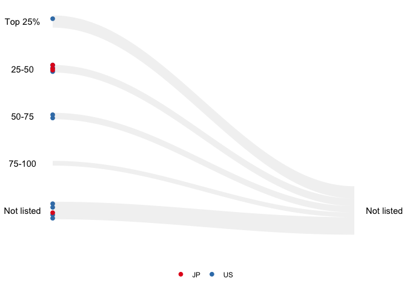

<!-- README.md is generated from README.Rmd. Please edit that file -->

# animbook 

<!-- badges: start -->
<!-- badges: end -->

“animbook” is a package to help the user visualize the changes in
performance measures and demographic affiliations using animation. It is
a package to help prepare, plot, and animate the data.

## Installation

You can install the development version of animbook from
[GitHub](https://github.com/KrisanatA/animbook) with:

``` r
install.packages("animbook")
```

## Examples

### Accounting database: osiris

``` r
library(animbook)
library(dplyr)
#> 
#> Attaching package: 'dplyr'
#> The following objects are masked from 'package:stats':
#> 
#>     filter, lag
#> The following objects are masked from 'package:base':
#> 
#>     intersect, setdiff, setequal, union

data <- osiris |> 
  filter(country %in% c("US", "JP"))

label <- c("Top 25%", "25-50", "50-75", "75-100", "Not listed")

accounting <- anim_prep(data, 
                      id = ID, 
                      values = sales, 
                      time = year, 
                      label = label, 
                      ncat = 4, 
                      group = country)

p <- wallaby_plot(accounting,
                  group_palette = RColorBrewer::brewer.pal(9, "Set1"),
                  shade_palette = c("#737373", "#969696", "#BDBDBD",
                                    "#D9D9D9","#D9D9D9","#D9D9D9"),
                  subset = "bottom",
                  relation = "many_one",
                  height = 1,
                  size = 2,
                  width = 100,
                  total_point = 1000)
#> You can now use the animbook::anim_animate() function to
#>           transform it into an animated object

p2 <- anim_animate(p)
#> You can now pass it to gganimate::animate().
#>                    The recommended setting is nframes = 139

gganimate::animate(p2, nframes = 139)
```


### Voter behavior

``` r
library(animbook)

voter <- anim_prep_cat(data = aeles,
                       id = id,
                       values = party,
                       time = year,
                       group = gender,
                       order = NULL)

p_voter <- wallaby_plot(data = voter,
                  group_palette = c("pink", "blue", "red"),
                  shade_palette = c("#737373", "#969696", "#BDBDBD",
                                    "#D9D9D9","#D9D9D9","#D9D9D9"),
                  time_dependent = FALSE,
                  rendering = "gganimate",
                  subset = "top",
                  relation = "one_many",
                  height = 1,
                  size = 2.5,
                  width = 100,
                  total_point = 1000)
#> You can now use the animbook::anim_animate() function to
#>           transform it into an animated object

p2_voter <- anim_animate(p_voter)
#> You can now pass it to gganimate::animate().
#>                    The recommended setting is nframes = 139

gganimate::animate(p2_voter, nframes = 139)
```


