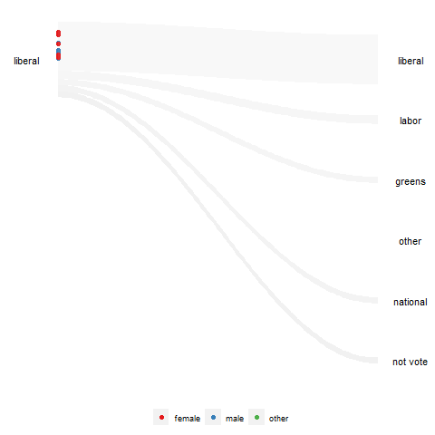

```{r, include = FALSE}
knitr::opts_chunk$set(
  collapse = TRUE,
  comment = "#>"
)
```

```{r setup}
library(animbook)
```


The inspiration for this package comes from the NY Times animated plot. The challenge of reproducing the animation is the amount of code required. This package tries to solve that by reducing it to only three steps. This package also adds a new element of proportional Sankey shaded area.


### First stage: Prepare the data

In this stage, we first need to prepare the data structure to a specific format. This function will assign a frame, calculate the scaling, and create the necessary data and settings for the next stage.

The data needs to contain the following variable for the function to work:

- id: `ID`, it needs to be a factor variable.
- values: `sales`, it need to be a numeric variable.
- time: `year`, it needs to be an integer variable.

```{r}
animbook <- anim_prep(osiris, ID, sales, year)
```

There are also additional options that allow the user to customize.

- label: group labeling.
- ngroup: number of groups we want to split the values into.
- breaks: the group bins size (prototype)
- group_scaling: the grouping variable for the bins calculations.
- color: the variable used to color the observations.
- time_dependent: logical. Whether we want the observations to start at the same time or not.
- scaling: the scaling method, either `rank` or `absolute`.
- runif_min: minimum value for random addition to frame numbers
- runif_max: maximum value for random addition to frame numbers

The function can calculate four different scales using these options.

```{r}
# rank scaling
rank_scaling <- anim_prep(data = osiris, id = ID, values = sales, time = year)

# absolute scaling
absolute_scaling <- anim_prep(data = osiris, id = ID, values = sales, time = year,
                              scaling = "absolute")

# rank scaling by group
rank_group_scaling <- anim_prep(data = osiris, id = ID, values = sales, time = year, 
                                group = country)

# absolute scaling by group
absolute_group_scaling <- anim_prep(data = osiris, id = ID, values = sales, time = year,
                                    group = country, scaling = "absolute")

rank_scaling
```

This function will return `animbook` object containing a list of the formatted data and settings.


### Second stage: Plotting the data

After preparing the data, we can not plot it. There are three plots available in this package:

- `kangaroo`, which plots the observation's movement over time.
- `wallaby`, which subset the plot to either `top` or `bottom` and see which group they are in after the observational period.
- `funnel_web_spider`, which is a faceted plot by time variable.

```{r}
label <- c("Top 20%", "20-40", "40-60", "60-80", "80-100", "not listed")

animbook <- anim_prep(data = osiris, id = ID, values = sales, time = year, color = japan, label = label)

# kangaroo plot
kangaroo_plot(animbook)

# wallaby plot
wallaby_plot(animbook)
            
# funnel web spider plot
funnel_web_plot(animbook)
```

The `kangaroo` and `wallaby` plots can be animated using the function of the next stage. `funnel_web_spider` only supported static plot. We can also choose whether we want to animate the plot using gganimate or plotly.


### Third stage: Animating the plot

To animate the plot, we need to save the plot into an object, which then can be passed on to the function.

```{r, eval = FALSE}
animbook <- anim_prep_cat(data = aeles, id = id, values = party, time = year, color = gender, time_dependent = FALSE)

p <- wallaby_plot(animbook)

p2 <- anim_animate(p)

gganimate::animate(p2)
```
```{r, echo = FALSE}

```

